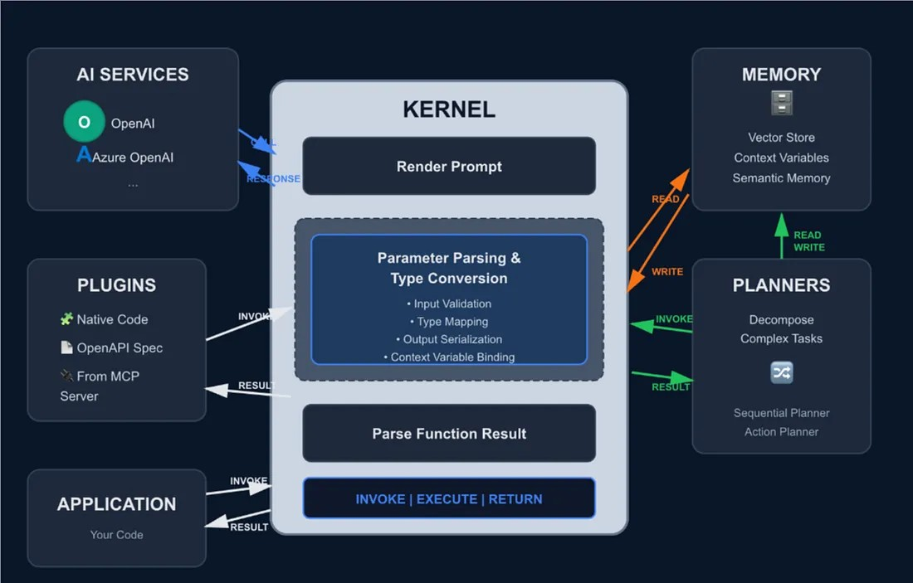

 Thanks for getting here! please <b>give a ⭐</b> if you liked the project. This project is related to conversational AI Agent.
Semantic Kernel Soup Order Agent
A practical example demonstrating how to build a conversational AI agent using Microsoft Semantic Kernel with Google Gemini as the LLM provider. This project shows how to 
transform traditional C# business logic into AI-powered, natural language interfaces through function calling.
🎯 What This Project Demonstrates

Plugin Architecture: How to expose C# methods as functions callable by an LLM
These are the components that are used by your AI services and prompt templates to perform work.
AI services, for example, can use plugins to retrieve data from a database or call an external API to perform actions.
AI Services: Abstraction adapters that bridge the Kernel and external AI models, encapsulating communication with different AI service providers 
(OpenAI, Google Gemini, Azure OpenAI, etc.) through a unified interface. This allows you to switch providers without changing your code.
Function Calling: Automatic invocation of business logic based on natural language
Chat History Management: Maintaining conversational context across interactions
Dependency Injection: Integrating Semantic Kernel with .NET's DI container
Real-world Scenario: Complete soup ordering workflow from menu browsing to checkout

🚀 Features
Users can interact with the agent using natural language to:

Browse the soup menu
Add soups to their cart (specifying size, toppings, quantity)
View cart contents and totals
Remove items from the cart
Complete the checkout process

Example Interactions:
User > Hello How are you?
Assistant > I am doing well, thank you! How can I help you today?
User > Need Soup
Assistant > Great! What kind of soup are you in the mood for? You can also say "What's on the menu?" to see our selections.
User > What's on the menu?
Assistant > We have a variety of soups! Our specialty soups are French Onion, Ramen, and Mixed. We also have a selection of toppings including Hearty, Noodle, and Creamy.
Would you like to hear more about any of these or perhaps add one to your cart?
User > yes
Assistant > Which soup would you like to know more about?
User > Ramen
Assistant > Our Ramen soup comes with "Hearty" and "Noodle" as default toppings. It's described as having "Crispy bacon bits, homemade Croûtons, toasted seeds/nuts, or a dollop of Greek yogurt."
Would you like to add a Ramen soup to your cart? If so, what size and quantity?
User > 250m 1pcs
Assistant > It looks like you're trying to order a small size. The available sizes are "Small", "Medium", and "Large". Would you like a "Small" Ramen soup? And just to confirm, you'd like 1 piece?

📋 Prerequisites

.NET 8.0 or higher
Google Gemini API key (Get one here) because we are using Google AI Model. We can also use OpenAI or Azure OpenAI or Mistral or HuggingFace. For More Information refer below link
https://github.com/MicrosoftDocs/semantic-kernel-docs/blob/main/semantic-kernel/concepts/ai-services/embedding-generation/index.md 
Visual Studio 2022 / VS Code / Rider

🛠️ Installation

Clone the repository:

command prompt-->projectdirectory> git clone https://github.com/moises-zp/agent_for_pizzas.git
cd SoupAIConversationalAgent
Install dependencies:

open commandprompt--> PathToProjectrootdirectory> dotnet restore
or 
install the packages 
Install the core NuGet package into your .NET 8+ project:
dotnet add package Microsoft.SemanticKernel
For Google Gemini support specifically, add the Google connector:
dotnet add package Microsoft.SemanticKernel.Connectors.Google
Configure your API key in appsettings.json:

csharp var apiKey = "YOUR_GEMINI_API_KEY";
▶️ Running the Application
PathToProjectrootdirectory> dotnet run
Type your messages in the console. Type exit or salir to quit.

🔑 Key Concepts
Plugin Definition
The simplest type of plugin is a native function plugin: a C# class with methods decorated with [KernelFunction] and [Description] attributes.
Functions are exposed to the LLM using the [KernelFunction] attribute:
csharp[KernelFunction("add_soup_to_cart")]
[Description("Add a soup to the user's cart")]
The [Description] attributes are critical -- they tell the LLM what each function does and when to call it. Always write clear, complete descriptions
There are three primary ways of importing plugins into Semantic Kernel:
Using native code: Functions written directly in C# (or Python/Java)
Using an OpenAPI specification: Import existing REST APIs automatically.
From a MCP Server: Connect to Model Context Protocol servers

Execution and Conversation Loop (Worker)
In the Worker class, where the application logic runs, we coordinate the interaction between the user, the LLM, and the services. This is where:

We register the Plugin: AddFromObject registers the available functions
We create the ChatHistory: To maintain the complete conversation context
We define the system’s base behavior: Using the AddSystemMessage method
We configure ToolCallBehavior: So the LLM automatically invokes functions as needed
Conversational loop: Each user message is processed, the LLM decides which functions to invoke, and returns a response

Chat Flow

User input is added to ChatHistory
LLM analyzes the request
Semantic Kernel automatically invokes the appropriate function(s)
Results are returned to the LLM
LLM generates a natural language response

📦 NuGet Packages Used

Microsoft.SemanticKernel - Core framework
Microsoft.SemanticKernel.Connectors.Google - Gemini integration
Microsoft.Extensions.Hosting - DI and hosting
Microsoft.Extensions.Logging - Logging infrastructure

🔧 Configuration Options
Temperature
Controls response randomness (0.0 - 1.0). Lower values are more deterministic.
Model Selection
Available Gemini models:

gemini-2.0-flash-exp - Fast and efficient
gemini-1.5-pro - More capable, slower

Function Invocation Modes

AutoInvokeKernelFunctions - Automatic execution (recommended)
EnableKernelFunctions - Manual approval required

📚 Learning Resources

Semantic Kernel Documentation
Google Gemini API

🙏 Acknowledgments

Microsoft Semantic Kernel team
Google Gemini team
.NET community

 
Project Link: https://github.com/majidakhter/SoupAIConversationAgent

Note: This is a sample project for educational purposes. The payment processing is simulated and the data storage is in-memory only.
